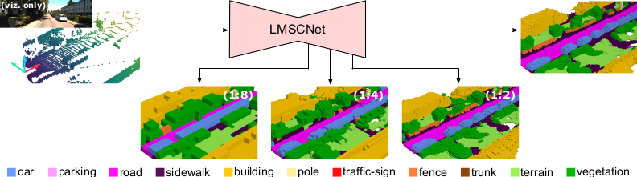

# LMSCNet: Lightweight Multiscale 3D Semantic Completion
Official repository.  

[](https://paperswithcode.com/sota/3d-semantic-scene-completion-on-semantickitti?p=lmscnet-lightweight-multiscale-3d-semantic)

## Paper


[LMSCNet: Lightweight Multiscale 3D Semantic Completion](https://arxiv.org/abs/2008.10559) \
[Luis Roldão](https://team.inria.fr/rits/membres/luis-roldao-jimenez/), [Raoul de Charette](https://team.inria.fr/rits/membres/raoul-de-charette/), [Anne Verroust-Blondet](https://team.inria.fr/rits/membres/anne-verroust/)  
Inria, Akka Research. 3DV 2020 (oral) \
[[Demo Video]](https://www.youtube.com/watch?v=J6dYoWx4Xqw&feature=youtu.be)


If you find our work useful, please cite:
```
@inproceedings{roldao2020lmscnet,
  title={LMSCNet: Lightweight Multiscale 3D Semantic Completion},
  author={Rold{\~a}o, Luis and de Charette, Raoul and Verroust-Blondet, Anne},
  booktitle={International Conference on 3D Vision (3DV)},
  year={2020}
}
```

## Preparation
### Prerequisites
Tested with
* PyTorch 1.3.1
* CUDA 10.2
* Python 3.7.5
* Numpy 1.17.4

### Setup
We advise to create a new conda environment for installation.

```
$ conda create --name lmscnet_ssc python=3.7.5 numpy tqdm scipy scikit-learn pyyaml imageio tensorboard -y
$ conda activate lmscnet_ssc
$ conda install pytorch torchvision cudatoolkit=10.0 -c pytorch
```

Then clone this repository in desired location
```
$ git clone https://github.com/cv-rits/LMSCNet
```

### Dataset

Please download the Full Semantic Scene Completion dataset (v1.1) from the [SemanticKITII website](http://www.semantic-kitti.org/dataset.html) and extract it.

You need to preprocess the data to generate lower scale labels for LMSCNet first.
The preprocessing performs majority pooling over high-resolution original scale label
grids (1:1) in order to obtain ground-truth data at lower resolutions (1:2, 1:4 and 1:8).
It also generates validity masks as such resolutions to consider the loss on known voxels only,
as in original scale data. All information will be stored in the same format and respective location
than the semanticKITTI provided data with new file extensions (`file.label_1_X` and `file.invalid_1_X`).

If you are using **v1.1** of the dataset, you can download the data directly from [here](https://www.rocq.inria.fr/rits_files/download.php?file=computer-vision/lmscnet/semanticKITTI_v1.1_dscale.zip).
Please extract the data into the semanticKITTI root folder. 

Otherwise, you need to generate the data by running the `LMSCNet/data/labels_downscale.py` as follows:
```
$ cd <root dir of this repo>
$ python LMSCNet/data/labels_downscale.py --dset_root <path/dataset/root>
```
* `dset_root` should point to the root directory of the SemanticKITTI dataset (containing `dataset` folder)

## Training

All training settings can be edited by using the yaml file generator in `SSC_configs/config_routine.py`. We provide training
routine examples in the `SSC_configs/examples/` folder. Make sure to change the dataset path to your extracted dataset location in such files if you 
want to use them for training. Additionally, you can change the folder where the performance and stats will be stored, this folder has been defined as `SSC_out` by default.
* `config_dict['DATASET']['ROOT_DIR']` should be changed to the root directory of the SemanticKITTI dataset (containing `dataset` folder)
* `config_dict['OUTPUT']['OUT_ROOT'] ` to be changed to desired output folder.

### LMSCNet & LMSCNet-SS
You can run the training with
```
$ cd <root dir of this repo>
$ python LMSCNet/train.py --cfg SSC_configs/examples/LMSCNet.yaml --dset_root <path/dataset/root>
```

We also provide single scale version of our network which can achieve slightly better performance at
the cost of losing multiscale capacity:
```
$ cd <root dir of this repo>
$ python LMSCNet/train.py --cfg SSC_configs/examples/LMSCNet_SS.yaml --dset_root <path/dataset/root>
```

### Baselines
Train coded baselines with:
```
$ python LMSCNet/train.py --cfg SSC_configs/examples/SSCNet.yaml --dset_root <path/dataset/root>
$ python LMSCNet/train.py --cfg SSC_configs/examples/SSCNet_full.yaml --dset_root <path/dataset/root>
```

In all previous examples you need to provide your path to the dataset folder, if not provided, the path
set in the `.yaml` file will be used by default.

## Validating & Testing

Validation passes are done during training routine. Additional pass in the validation set with saved model 
to check performance can be done by using the `LMSCNet/validate.py` file. You need to provide the path to the saved model and the 
dataset root directory.

```
$ cd <root dir of this repo>
$ python LMSCNet/validate.py --weights </path/to/model.pth> --dset_root <path/dataset/root>
```

Since SemantiKITTI contains a hidden test set, we provide test routine to save predicted output in same
format of SemantiKITTI, which can be compressed and uploaded to the [SemanticKITTI Semantic Scene Completion Benchmark](http://www.semantic-kitti.org/tasks.html#semseg).
We recommend to pass compressed data through official checking script provided in the [SemanticKITTI Development Kit](http://www.semantic-kitti.org/resources.html#devkit) to avoid any issue.
You can provide which checkpoints you want to use for testing. We used the ones that performed best on the validation set during training.
You need to provide the path to the saved model, the 
dataset root directory and the output path to where the predictions will be stored.

```
$ cd <root dir of this repo>
$ python LMSCNet/test.py --weights </path/to/model.pth> --dset_root <path/dataset/root> --out_path <predictions/output/path>
```

## Ablation

We test the robustness of our network against sparsity by retrieving the original 64-layers KITTI scans used in SemanticKITTI
and subsampling 8/16/32 layers LiDARs with layers subsampling.

_coming up soon..._

<!---
## Acknowledgements
This work has been developed in collaboration between INRIA and AKKA Technologies, under the funding of AKKA Technologies. 
-->

## Model Zoo

You can download the models with the scores below from this [Google drive folder](https://drive.google.com/drive/folders/12A46LE3BO6tQ8Y5OFbR4ImP7nzM8_3wb?usp=sharing).

| Method                    | SC IoU               | SSC mIoU             |
| ------------------------- | -------------------- | -------------------- |
| SSCNet-full               | 49.98<sup>*</sup>    | 16.14<sup>*</sup>    |
| LMSCNet                   | 55.32<sup>*</sup>    | 17.01<sup>*</sup>    |
| LMSCNet-SS                | 56.72<sup>*</sup>    | 17.62<sup>*</sup>    |


<sup>*</sup> Results reported correspond to SemanticKITTI hidden test set V1.0. 
SemanticKITTI benchmark has recently changed
to v1.1 due to grid shift issue ([link](https://github.com/PRBonn/semantic-kitti-api/issues/49)). This should bring also slight differences if re-uploaded to test benchmark. 

## License
LMSCNet is released under the [Apache 2.0 license](./LICENSE).
